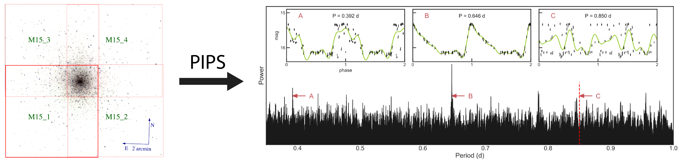
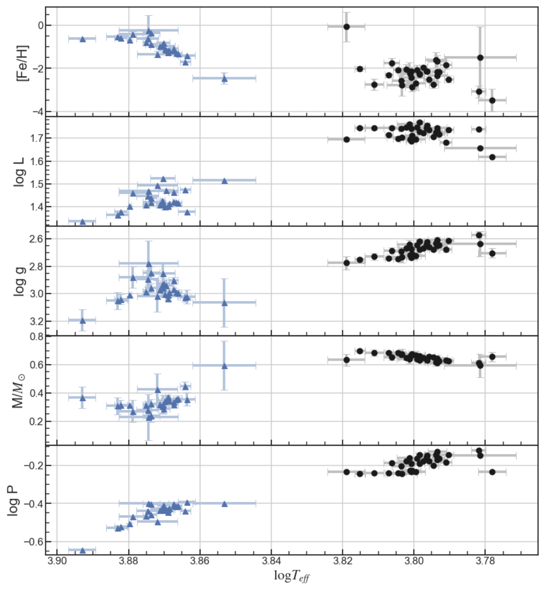
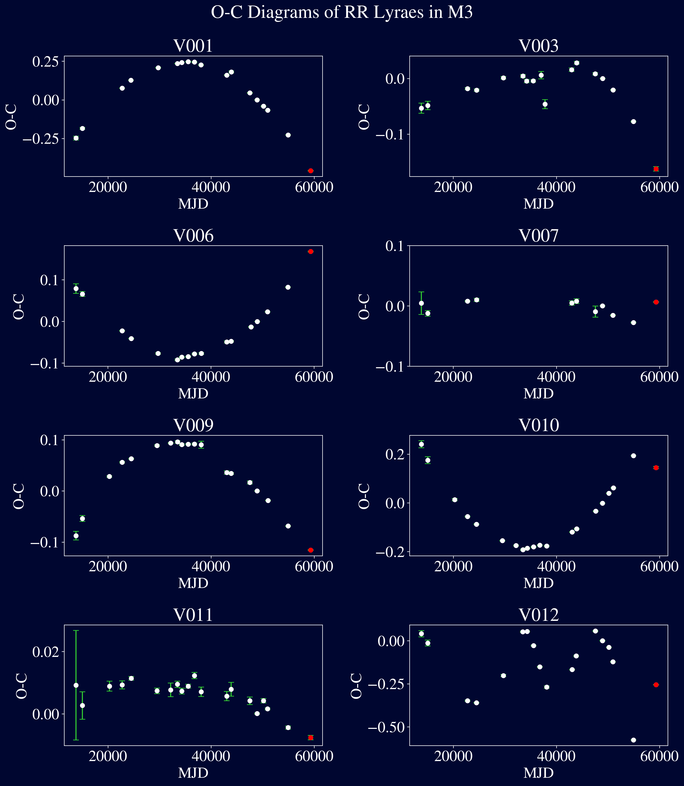
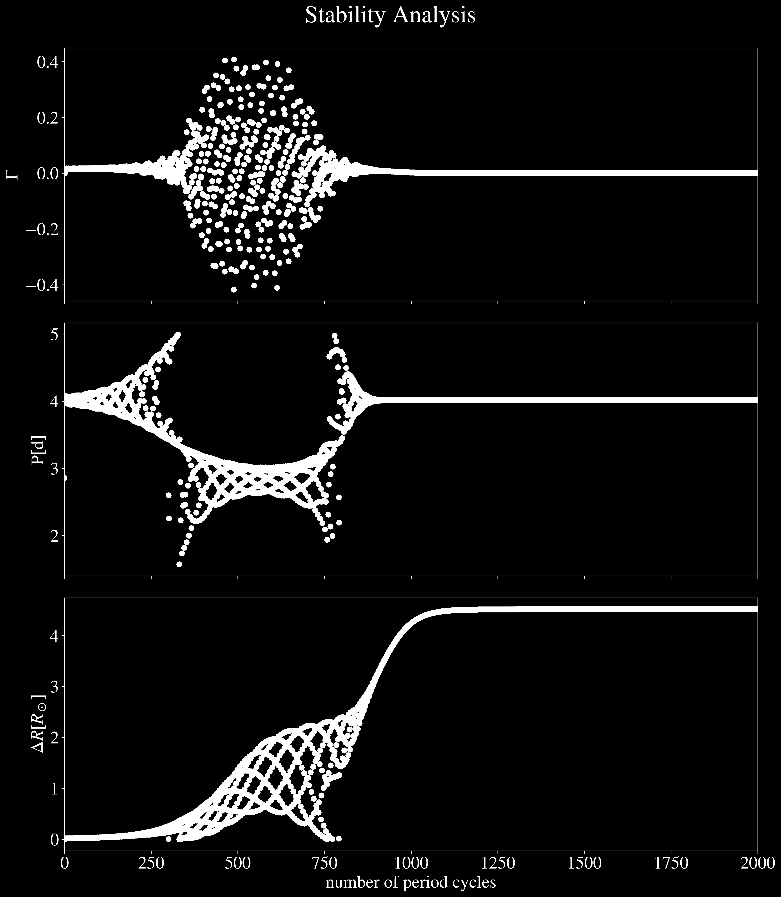

# Variable Stars

A repo to hold all of my old observational work studying RR Lyrae variable stars in globular clusters. All of the work I have done can be found in the `projects` folder. It is jumbled and not the cleanest (I was learning how to code during this time... please forgive me on that) but nonetheless, all the important work I did is stored here.

A broad overview/timeline of the work is as follows. I started working on variable stars in my Stellar Physics course at UC Berkeley alongside my friend and peer Raphael Baer-Way. Together we used the KAIT telescope at LICK Observatory under the supervision of Prof. Alex Filippenko and Yukei Murakami in Fall 2020 to observe variable stars in a globular cluster (stored in `projects/Astro_160_Project`). From there we worked with Yukei to help build the PIPS package documented in [Murakami et al. 2022](https://doi.org/10.1093/mnras/stac1538) (this work is stored in `projects/PIPS_Project_Workspace` and `projects/M15_Project`). Along the way we also ventured into studying variable stars in the Globular Cluster M3 which we then presented via iPoster at the 238th AAS Meeting winning the Chambliss Award (work stored in `projects/M3_Project_Stuff`). We also ventured into simulating variable stars to model their temperature profiles using the well-known 1D stellar physics simulation package MESA. 

Some samples of our work can be seen in sample plots below:

## PIPS & M15

I was a contributor to the PIPS package led by Yukei Murakami. My role was to implement stellar physics modules in the package before we generalized the package to variable data rather than only for RR Lyraes. This work was ultimately never used in the paper. Below is an image showing what PIPS does, this image is modified from [Hoffman et al. 2021](https://doi.org/10.1093/mnras/stab010) and [Murakami et al. 2022](https://doi.org/10.1093/mnras/stac1538).

  

This figure shows the idea of PIPS in that we feed it photometry data of variable objects over time and the package finds the best period to fold the lightcurve data overtime to construct a periodic lightcurve. More details are outlined in [Murakami et al. 2022](https://doi.org/10.1093/mnras/stac1538). 

We also estimated physical properties of stars in M15 as seen below

  

## M3 Project

My role in this project was to measure the period over long periods of time to see the drift of the stars' periods over decades. This information was done for variable stars in M3. I made O-C diagrams for RR Lyraes in M3. This work is shown below.

  

Along the way, I also ventured into simulating RR Lyraes using MESA. A sample stability analysis of our simulations is shown below

  

